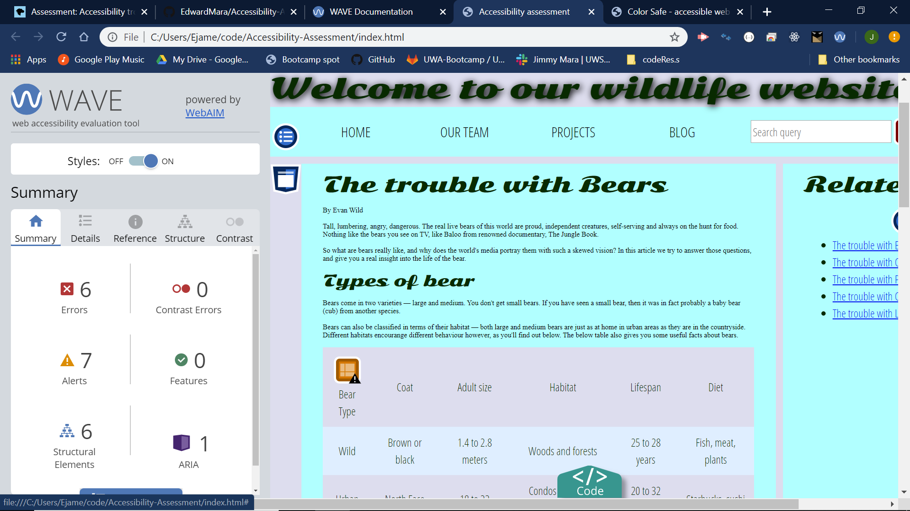

# Accessibility Troubleshooting
Source code provided by Mozilla Developer Network

## Tools Used
- WAVE Web Accessibility Evaluation Tool
- ChromeVox screen reader

## Accessibility Issues Addressed
### Color
The text is difficult to read because of the current color contrast.

WAVE reports 19 contrast errors.
This means that WAVE detected very low contrast between foreground and background colors. Adequate contrast is necessary for all users, especially users with low vision.

After altering the font and background colors in the css...No more contrast errors!

### Semantic HTML
HTML tags should be updated to proper HTML5 semantics to allow screen readers to navigate and translate pages correctly.